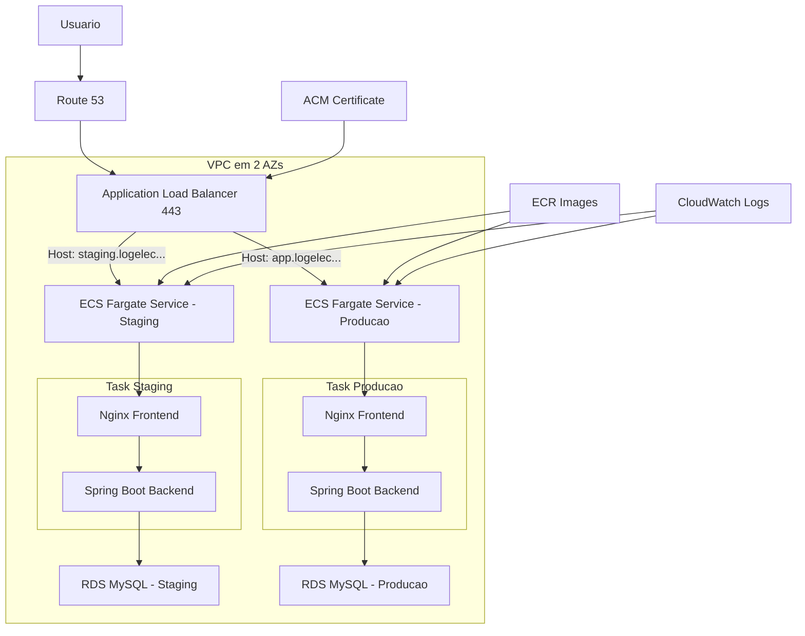

# Arquitetura AWS Mínima para Staging e Produção

Arquitetura mínima recomendada para publicar o LogElec com domínio, DNS e HTTPS, preservando o comportamento atual do sistema e reduzindo risco de adaptação.

## Objetivo da arquitetura

- manter o frontend e o backend acessados pelo mesmo domínio.
- publicar `staging` e `produção` com isolamento suficiente para homologação.
- terminar TLS na AWS com certificado gerenciado.
- manter MySQL fora dos containers de aplicação.

## Desenho recomendado para primeira publicação

- `Route 53` para zona DNS do domínio.
- `AWS Certificate Manager` para certificados HTTPS.
- `Application Load Balancer` público.
- `ECS Fargate` para rodar a aplicação conteinerizada.
- `RDS MySQL` para persistência.
- `ECR` para armazenar as imagens do frontend e backend.
- `CloudWatch Logs` para observabilidade básica.
- `Secrets Manager` ou `SSM Parameter Store` para segredos.

## Ambientes e domínios sugeridos

- `staging.logelec.seudominio.com.br`
- `app.logelec.seudominio.com.br`

## Topologia mínima

- uma `VPC`.
- duas subnets públicas para o ALB.
- duas subnets privadas para ECS e RDS.
- um serviço ECS Fargate por ambiente.
- uma instância RDS por ambiente, ou no mínimo bancos separados com credenciais separadas.

## Modelo operacional recomendado

Para a primeira publicação, o menor risco é manter cada ambiente como um serviço ECS com um task definition contendo:

- container `frontend` com Nginx.
- container `backend` com Spring Boot.

Motivo:

- espelha o `docker-compose` atual.
- reduz o número de moving parts para o primeiro deploy.
- preserva o contrato de mesmo domínio entre frontend e API.

### Ajuste mínimo necessário para o Nginx em AWS

Hoje o Nginx do compose usa `proxy_pass http://backend:8080/api/;`.

No ECS, a forma mais simples é trocar esse upstream para `http://127.0.0.1:8080/api/` dentro do task de cada ambiente, porque frontend e backend rodam no mesmo task.

Esse é o menor ajuste estrutural para a primeira publicação.

## Fluxo DNS e HTTPS

1. o usuário acessa `https://staging.logelec.seudominio.com.br` ou `https://app.logelec.seudominio.com.br`.
2. o `Route 53` resolve o domínio para o `Application Load Balancer`.
3. o `ACM` entrega o certificado TLS ao ALB.
4. o ALB encaminha a requisição para o serviço ECS correto por host header.
5. o container Nginx entrega o frontend e faz proxy de `/api/*` para o backend Spring Boot no mesmo task.
6. o backend acessa o `RDS MySQL` em subnets privadas.

## Diagrama lógico

## Segurança mínima aceitável

- ALB exposto apenas em `80` e `443`, com redirect de `80` para `443`.
- ECS e RDS em subnets privadas.
- security group do backend aceitando tráfego apenas do frontend do mesmo task/serviço ou da malha interna do task.
- security group do RDS aceitando tráfego apenas do backend.
- credenciais de banco fora da imagem, em segredo gerenciado.
- sem acesso público direto ao RDS.

## Banco de dados

### Staging

- MySQL pequeno, sem Multi-AZ se o orçamento for apertado.
- pode ser refeito com frequência.
- usar dados mascarados ou seed de homologação.

### Produção

- MySQL com backup automático ativado.
- storage e retenção definidos.
- Multi-AZ é recomendável se o ambiente deixar de ser apenas acadêmico/demonstrativo.

## Deploy mínimo por ambiente

1. build das imagens `frontend` e `backend`.
2. push das imagens para o `ECR`.
3. atualização do task definition ECS.
4. rollout controlado do serviço.
5. smoke test no domínio com HTTPS.

## O que fica fora do mínimo inicial

- `CloudFront` na frente do frontend.
- `WAF`.
- `CI/CD` completo.
- autoscaling refinado por métrica.
- observabilidade avançada com tracing.

Esses itens são recomendados depois que a primeira publicação estiver estável.

## Critério para seguir para publicação

- domínio registrado e hospedado no `Route 53`.
- certificado emitido no `ACM`.
- imagens publicadas no `ECR`.
- serviço ECS saudável nos dois ambientes.
- backend conectando ao RDS corretamente.
- login, perfil, postagens, agendamento e admin acessíveis por HTTPS no subdomínio alvo.

## Evolução recomendada depois da primeira entrada no ar

Quando a publicação inicial estiver estável, a evolução mais natural é:

1. separar frontend e backend em serviços ECS independentes.
2. mover o roteamento `/api/*` para o ALB.
3. considerar `CloudFront` para cache do frontend.
4. adicionar pipeline de deploy e aprovação para `staging` -> `produção`.